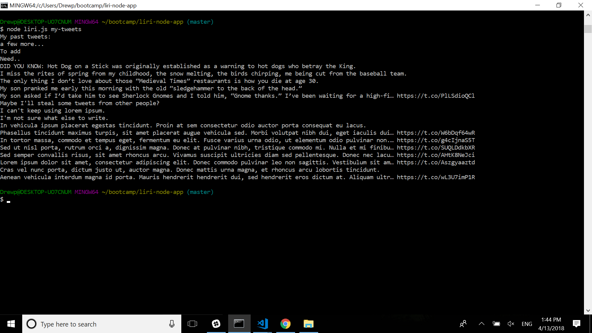
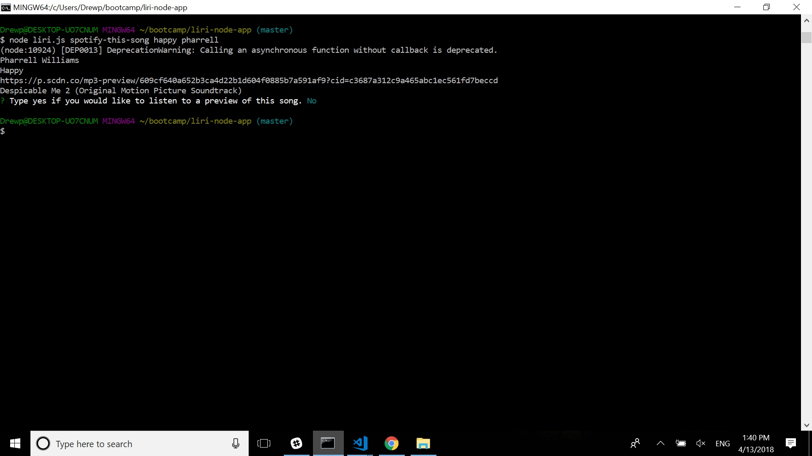
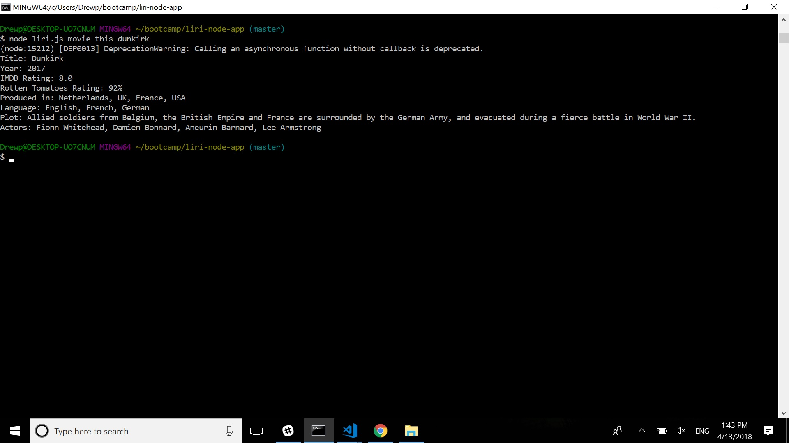
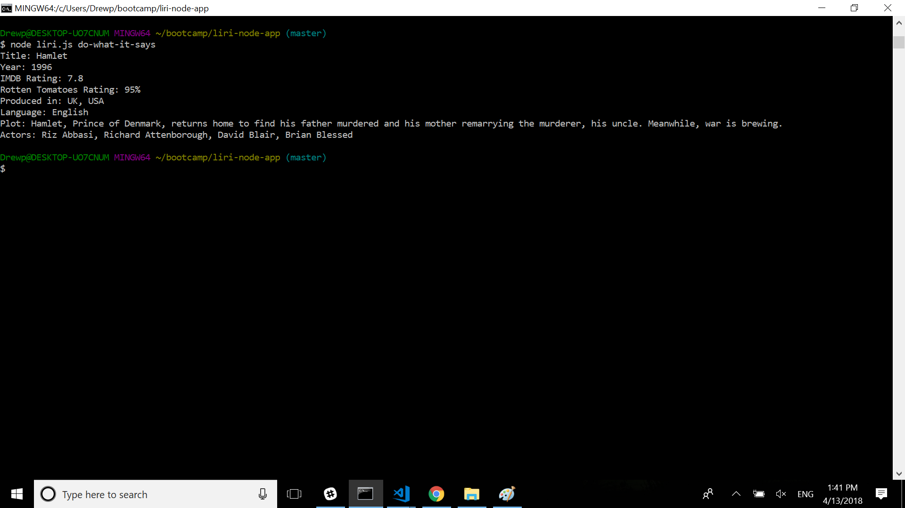

# liri-node-app
Language Interpretation and Recognition Software

The Liri Node App allows a user to access their previous tweets, search for movie information using OMDB, and search for song infromation using Spotify from the command line.

Utilizing APIs from Twitter, OMDB, and Spotify, the Liri Node App uses the inquirer node package to interact with the user.  The user has several options to choose from at the command line:

* my-tweets

* spotify-this-song ***

* movie-this ***

* do-what-it-says(creates command based on what is written in random.txt)

*** song name or movie name would be written here

Once the user presses enter, a request will be made utilizing the request node package to the specified API.

